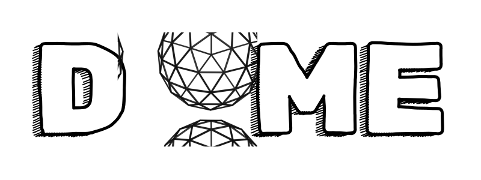

---

# dome

**dome** is a minimalist dotfiles manager written in Bash that offers bidirectional syncing between your home directory and a Git-based dotfiles repository. It features Git integration, conflict detection/resolution, pre/post-sync hooks, and an innovative distro-aware file mapping mechanism.

## Table of Contents

- [Overview](#overview)
- [Features](#features)
- [Requirements](#requirements)
- [Installation](#installation)
- [Configuration](#configuration)
- [Usage](#usage)
- [Syncing Mechanism](#syncing-mechanism)
- [Hooks and Customizations](#hooks-and-customizations)
- [Troubleshooting](#troubleshooting)
- [Contributing](#contributing)
- [License](#license)

## Overview

`dome` is designed to be simple, robust, and unobtrusive. It allows you to keep your dotfiles (such as `.bashrc`, Neovim or tmux configurations) in a Git repository and mirror them with your home directory. With integrated distro-aware mapping, you can even manage variations in configuration (e.g. different aliases or paths) for different Linux distributions.

## Features

- **Bidirectional Syncing:** Keep your home and repository in perfect sync.
- **Git Integration:** Pull updates and push changes to your remote repository seamlessly.
- **Conflict Detection & Resolution:** Automatically detect conflicts and resolve them with your preferred merge tool.
- **Distro-Aware File Mapping:** Define distro-specific variants of your dotfiles using a simple YAML mapping.
- **Hooks:** Run custom commands before or after sync operations to automate tasks.
- **Minimalist Design:** Focus on simplicity and reliability.

## Requirements

- **Bash:** The script is written in Bash and intended for Unix-like systems.
- **rsync:** Used for file synchronization.
- **git:** For managing your dotfiles repository.
- **yq:** For parsing YAML configuration files.
- **Merge Tool (Optional):** For conflict resolution (e.g., `meld`).

## Installation

> [!NOTE]  
> Make sure that `~/bin/` is in your **$PATH**

Run:
```bash
curl -fsSL https://raw.githubusercontent.com/vvhybe/dome/main/install.sh | bash
```
> [!TIP]
> to install the latest version of `dome`, or install a specific [release](https://github.com/vvhybe/dome/releases) with its tag, e.g. `v1.0.0`:

**USE**:
```bash
curl -fsSL https://raw.githubusercontent.com/vvhybe/dome/main/install.sh | bash -s -- --tag=v0.2.0
```
> [!TIP]
> You can suppress the installation output with the flag `--silent` or `-s`:

## Initialize dome:

Run the initialization command to set up the configuration and clone your dotfiles repository:

```bash
dome init
```

## Configuration

The main configuration file is located at [`~/.config/dome/config.yaml`](config.yaml). This file contains settings for:

### Repository Settings

- **repo**: URL of your dotfiles Git repository.
- **branch**: The branch to use (e.g., `main`).
- **local_path**: The local path where your repository will be cloned (e.g., `~/.dotfiles`).

### Distro Files Mapping

Define mappings to handle distro-specific configurations. For example:

```yaml
distro_files:
  .bashrc:
    arch: ".bashrc.arch"
    debian: ".bashrc.debian"
```

In this example, if you're running an Arch-based system, `dome` will use `.bashrc.arch` from your repository to update `~/.bashrc`.

### Hooks

Customize actions before and after syncing, pushing, pulling:

```yaml
hooks:
  conflict_resolver: "meld"
  pre_sync: "echo 'Starting sync...'"
  post_sync: "echo 'Sync complete.'"
  pre_pull: "echo 'pulling using git'"
  post_pull: "echo 'pulled changes'"
  pre_push: "echo 'befor push'"
  post_push: "echo 'after push'"
```

## Usage

Run `dome` with the following commands:

- Initialize:
```bash
dome init
```
Sets up the configuration and clones the repository.

- Bidirectional Sync:
```bash
dome sync
```
Syncs dotfiles between your repository and home directory while applying distro-aware mappings.

- Pull Updates:
```bash
dome pull
```
Pull the latest changes from the remote repository.

- Push Changes:
```bash
dome push
```
Push your local changes to the remote repository.

> [!NOTE]  
> To push your changes you should commit them using default `git`. Then push them via `dome` so you take advantage to push `pre/post` hooks

- Resolve Conflicts:
```bash
dome resolve
```
Launch your configured merge tool to resolve any sync conflicts.

- Help & Version:
```bash
dome -h   # Show help message
dome -v   # Show version information
```

## Syncing Mechanism

`dome` maintains a true two-way mirror of your tracked `dotfiles`:

1. Repo → Home Sync:
A temporary “merged” view of your repository is created. Here, distro-specific files (as defined in the `distro_files` mapping) are copied to their fallback names before syncing. This merged view is then used to update your home directory.
2. Home → Repo Sync:
Only files that are already tracked in the repository are updated. If a file is part of a distro mapping, changes to the fallback file in your home directory are used to update the corresponding distro-specific file in the repository.

This ensures that only the dotfiles you want tracked are synchronized, protecting other home directory files (e.g., those in `.ssh` or `.cache`) from accidental inclusion.

## Hooks and Customizations

Customize your workflow using hooks:

- **Conflict Resolver**: Specify your preferred merge tool (e.g., `meld`) for resolving conflicts.
- **Pre-sync Hook**: Runs before the syncing process begins.
- **Post-sync Hook**: Runs after syncing completes.
- **Pre-pull Hook**: Runs before the changes pulling from the repo main stream.
- **Post-pull Hook**: Runs right after the changes pulled from the repo branch.
- **Pre-push Hook**: Runs before the changes get pushed to the repo main stream **should be commited first**.
- **Post-push Hook**: Runs after the changes pushed to the repo.

These hooks are defined in the YAML configuration and are executed automatically during the sync, git processes.

## Troubleshooting

- **Permission Issues**:
If you encounter permission errors during syncing, ensure that you have the appropriate read/write permissions. Avoid running `dome` with `sudo`.
- **Dependency Issues**:
Make sure `rsync`, `git`, and `yq` are installed and available in your `PATH`.
- **Conflict Resolution**:
If conflicts are detected, run `dome resolve` to launch your merge tool and address discrepancies

## Contributing

Contributions to `dome` are welcome! Please fork the repository, create pull requests, and open issues if you have suggestions or encounter bugs. Follow the repository's contribution guidelines.

## License

`dome` is distributed under the [GPL-3.0 License](LICENSE).

---

*Happy syncing! 🎉*
